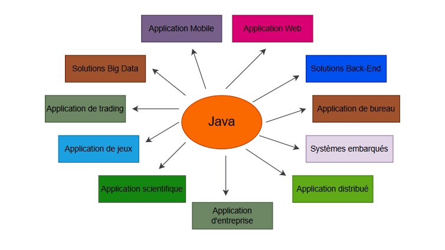

# La création de Java et ses utilisations

**Qui a crée Java ?**

Java a été créé par James Gosling chez Sun Microsystems (qui fait maintenant partie d'Oracle Corporation) et a été lancé en 1995.&#x20;

Le langage a été conçu avec plusieurs objectifs, notamment la nécessité d'un langage de programmation robuste, sécurisé, portable et performant. Java a été l'un des premiers langages de programmation à adopter le paradigme de programmation orientée objet, ce qui a contribué à sa popularité rapide parmi les développeurs.

**Java dans le monde de la Programmation aujourd'hui ?**

Aujourd'hui, Java est un pilier dans le développement d'applications variées, y compris pour Android, le Web, les applications back-end, et plus encore. Sa polyvalence et sa robustesse continuent de le rendre pertinent dans les domaines des solutions d'entreprise, des applications scientifiques, des jeux, et des technologies Big Data, etc.

<figure><figcaption>
Utilisations du Java
</figcaption></figure>

