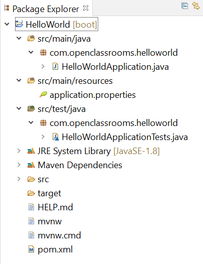

# Création du projet

Pour tout projet Spring Boot, les étapes sont généralement :

* Créer le projet (générer la structure minimale).
* Structurer et configurer le projet.
* Écrire le code.
* Tester et déployer.

Nous allons développer une requête **GET** API des tâches, en utilisant une base de données en mémoire (H2) avec Spring Boot en appliquants les concepts appris lors du cours.

## Création du projet

### Prérequis

Voici les outils nécessaires avant de créer le projet :

* Java Development Kit (JDK) installé : [https://www.oracle.com/fr/java/technologies/downloads](https://www.oracle.com/fr/java/technologies/downloads/#jdk21-windows)
* Un IDE (Eclipse ou IntelliJ IDEA) : [https://www.eclipse.org/downloads/](https://www.eclipse.org/downloads/)

### Génération de la structure minimale

Utiliser [_**https://start.spring.io/**_](https://start.spring.io/) pour générer le projet.

* Remplissez les champs : Nom (`crud`), Group (`com.api`), Artifact (`crud`).
* Choisissez les dépendances Spring Web, Spring Data JPA, H2 Database.

<div>

<figure><figcaption></figcaption></figure>

 

<figure><figcaption><p>Ça devrait ressembler à ça !</p></figcaption></figure>

</div>

À présent cliquez sur <mark style="color:green;">**Generate**</mark> et on est good !

### **Structure du projet** :

Sous Eclipse, voici la structure du projet.

<figure><figcaption></figcaption></figure>

<figure><figcaption></figcaption></figure>

Le contenu du fichier `pom.xml` devrait ressembler à ceci.


```xml
<?xml version="1.0" encoding="UTF-8"?>
<project xmlns="http://maven.apache.org/POM/4.0.0" xmlns:xsi="http://www.w3.org/2001/XMLSchema-instance"
	xsi:schemaLocation="http://maven.apache.org/POM/4.0.0 https://maven.apache.org/xsd/maven-4.0.0.xsd">
	<modelVersion>4.0.0</modelVersion>
	<parent>
		<groupId>org.springframework.boot</groupId>
		<artifactId>spring-boot-starter-parent</artifactId>
		<version>3.2.1</version>
		<relativePath/> <!-- lookup parent from repository -->
	</parent>
	<groupId>com.api</groupId>
	<artifactId>crud</artifactId>
	<version>0.0.1-SNAPSHOT</version>
	<name>crud</name>
	<description>Crud API for Spring Boot</description>
	<properties>
		<java.version>21</java.version>
	</properties>
	<dependencies>
		<dependency>
			<groupId>org.springframework.boot</groupId>
			<artifactId>spring-boot-starter-data-jpa</artifactId>
		</dependency>
		<dependency>
			<groupId>org.springframework.boot</groupId>
			<artifactId>spring-boot-starter-web</artifactId>
		</dependency>

		<dependency>
			<groupId>com.h2database</groupId>
			<artifactId>h2</artifactId>
			<scope>runtime</scope>
		</dependency>
		<dependency>
			<groupId>org.springframework.boot</groupId>
			<artifactId>spring-boot-starter-test</artifactId>
			<scope>test</scope>
		</dependency>
	</dependencies>

	<build>
		<plugins>
			<plugin>
				<groupId>org.springframework.boot</groupId>
				<artifactId>spring-boot-maven-plugin</artifactId>
			</plugin>
		</plugins>
	</build>

</project>
```

